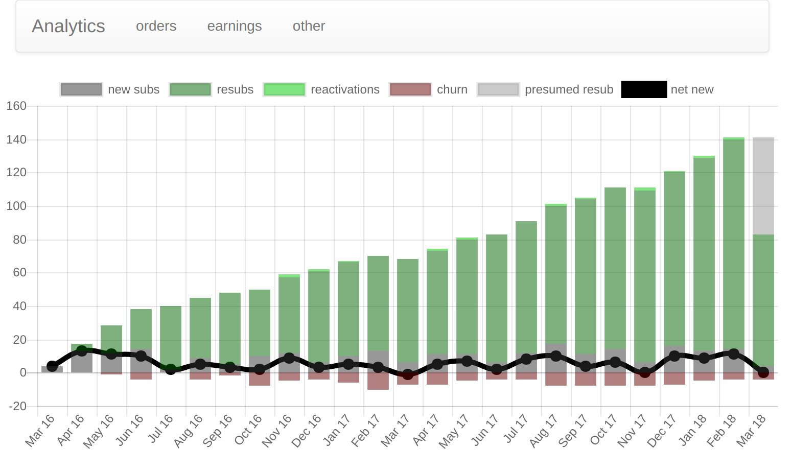

---
---

Analytics is a Chrome Extension that makes sense of your Google Payments Center data.
It can answer questions like:

* what's my monthly run rate over time?
* what’s my net growth in subscriptions over time?
* what's my customer lifetime value?

It runs locally, so your data never leaves your computer.
Here's an example of what an orders graph looks like:

